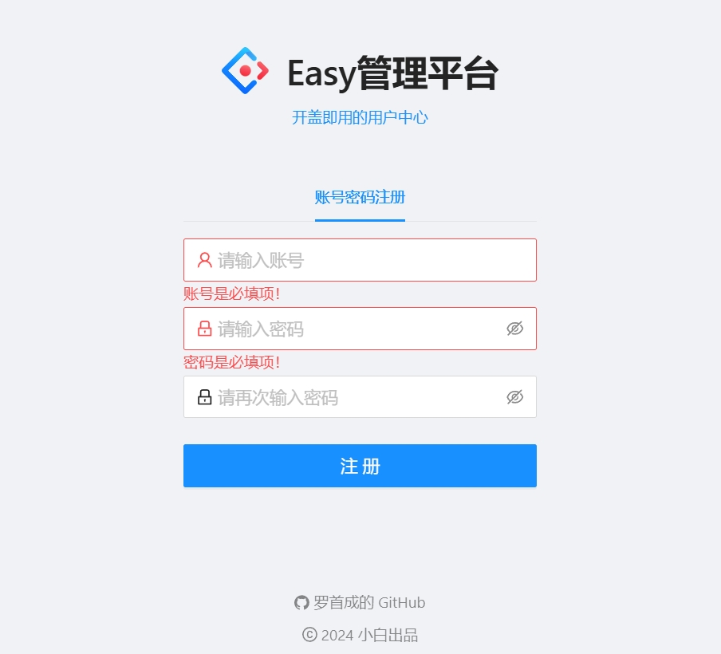

# 项目介绍

简单的一个用户管理系统，基于用户与管理员两种身份，实现了用户的注册登录，以及管理员对用户的增删改查功能

前端使用几乎现成的管理系统Ant design Pro，进行完后端接口测试进行前后端联调

# 数据库表设计

```java
-- auto-generated definition
create table user
(
    id           bigint auto_increment comment '用户id'
        primary key,
    username     varchar(256)      null comment '用户名',
    avatarUrl    varchar(256)      null comment '头像',
    gender       tinyint           null comment '性别',
    userAccount  varchar(256)      null comment '账号',
    userPassword varchar(512)      not null comment '用户密码',
    phone        varchar(256)      null comment '电话',
    email        varchar(256)      null comment '邮箱',
    creatTime    datetime          null comment '创建时间',
    updateTime   datetime          null comment '更新时间',
    isDelete     tinyint default 0 not null comment '逻辑删除',
    userStatus   int     default 0 not null comment '用户状态 '
)
    comment '用户表';
```

#  使用接口文档进行后端测试

```java
http://localhost:8080/api/doc.html#/
```


## 用户注册

```java
{
  "userAccount": "2098193121",
  "userPassword": "22222222",
  "checkPassword": "22222222"
}
```


## 用户登录

具有管理员身份的用户进行登录

```java
{
  "userAccount": "20011213",
  "userPassword": "12345678"
}
```


## 查询用户


## 删除用户


id为6的用户被逻辑删除


## 修改用户信息


修改前


修改后


# 前后端联调

## 登录


## 注册



## 管理员界面


## 普通用户界面


# 遇到问题

## 1.安装脚手架发现官网的命令用不了

node版本太低，重新下载

## 2.前端项目初始化，安装脚手架时候进度条不动

安装mirror镜像

## 3.使用Mybatis-Plus生成的方法不能用

mapper路径需要修改，底下的值也要修改

把mybatis的自动驼峰转换关闭

## 4.自己写的接口测试类不能运行

Springboot自己生成有一个测试类，如果自己再写，就要加上注解

## 5.swagger接口文档整合不成功

查看官方文档，以前项目中使用低版本的SpringBoot，需要写配置类 Knife4jConfiguration

```java
package com.example.center.configure;
import org.springframework.context.annotation.Bean;
import org.springframework.context.annotation.Configuration;
import org.springframework.context.annotation.Profile;
import springfox.documentation.builders.ApiInfoBuilder;
import springfox.documentation.builders.PathSelectors;
import springfox.documentation.builders.RequestHandlerSelectors;
import springfox.documentation.spi.DocumentationType;
import springfox.documentation.spring.web.plugins.Docket;
import springfox.documentation.swagger2.annotations.EnableSwagger2WebMvc;

@Configuration
@EnableSwagger2WebMvc
@Profile({"dev","test"})
public class Knife4jConfiguration {

    @Bean(value = "dockerBean")
    public Docket dockerBean() {
        //指定使用Swagger2规范
        Docket docket=new Docket(DocumentationType.SWAGGER_2)
                .apiInfo(new ApiInfoBuilder()
                        //描述字段支持Markdown语法
                        .description("# Knife4j RESTful APIs")
                        .termsOfServiceUrl("https://doc.xiaominfo.com/")
                        .contact("xiaoymin@foxmail.com")
                        .version("1.0")
                        .build())
                //分组名称
                .groupName("2.X版本")
                .select()
                //这里指定Controller扫描包路径
                .apis(RequestHandlerSelectors.basePackage("com.example.center.controller"))
                .paths(PathSelectors.any())
                .build();
        return docket;
    }
}

```

本次项目使用的3以上的版本，直接在yml文件中配置

```apl
# springdoc-openapi项目配置
springdoc:
  swagger-ui:
    path: /swagger-ui.html
    tags-sorter: alpha
    operations-sorter: alpha
  api-docs:
    path: /v3/api-docs
  group-configs:
    - group: 'default'
      paths-to-match: '/**'
      packages-to-scan: com.example,center.controller
# knife4j的增强配置，不需要增强可以不配
knife4j:
  enable: true
  setting:
    language: zh-CN
```

## 6.前后端联调的时候存在跨域问题

在前端进项代理

## 7.前端页面中的主题设置按钮不知道怎么关闭

未解决

## 8.前后端联调方法报415错误

未解决